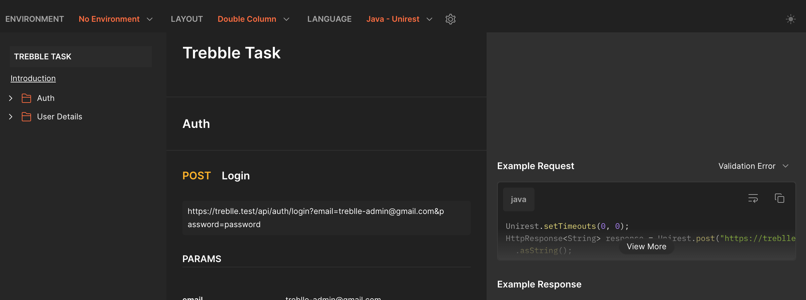

# Treblle Task

The task is to build a simple Laravel application that will allow a 
user to log in or register, and update their details. 
The user should be able to update these details through a web interface as well as an API request.


# Api Documentation


## Link to Api documentation
[https://documenter.getpostman.com/view/14195862/2s93m1YP2C](https://documenter.getpostman.com/view/14195862/2s93m1YP2C)

## Installation

Clone the repo locally:

```sh
git clone https://github.com/Lowkey1729/treblle-task.git treblle-task
cd treblle-task
```

Install PHP dependencies:

```sh
composer install
```

Install NPM dependencies:

```sh
npm ci
```

Build assets:

```sh
npm run dev
```

Setup configuration:

```sh
cp .env.example .env
```

Generate application key:

```sh
php artisan key:generate
```

In order to be able to run the test cases, Create an SQLite database. You can also use another database (MySQL, Postgres), simply update your configuration accordingly.

```sh
touch database/database.sqlite
```

Create a mysql database and simply update your configuration accordingly.


Run database migrations:

```sh
php artisan migrate
```

Run database seeder:

```sh
php artisan db:seed
```

Run the dev server (the output will give the address):

```sh
php artisan serve
```

You're ready to go! Treblle task in your browser, and login with:

- **email:** treblle-admin@gmail.com
- **Password:** password

## Running tests

To run the Treblle task tests, run:

```sh
composer test:unit
```
